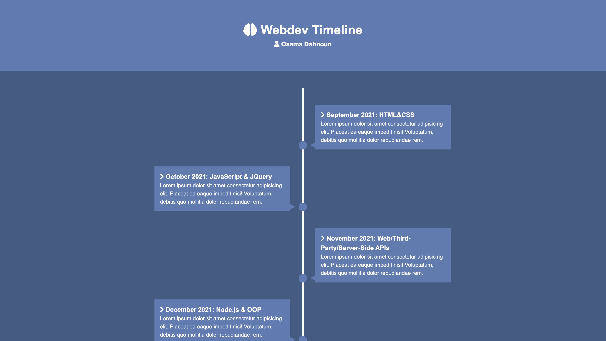

# Webdev Timeline (UI mastery series 5 of 8)

## Descripton

This mini project is the fifth in my UI mastery series. The UI mastery series is a series I created consisting of eight total projects (mini and full projects) to really master my UI development skills. For this project, I've built a beautiful website to showcase a timeline of my journey learning web development.

## Screenshot of Deployd Application

## Link to Deployed Application

https://osamadahnoun.github.io/Webdev-Timeline/

## Contribution

Made with love by Osama Dahnoun ❤️
